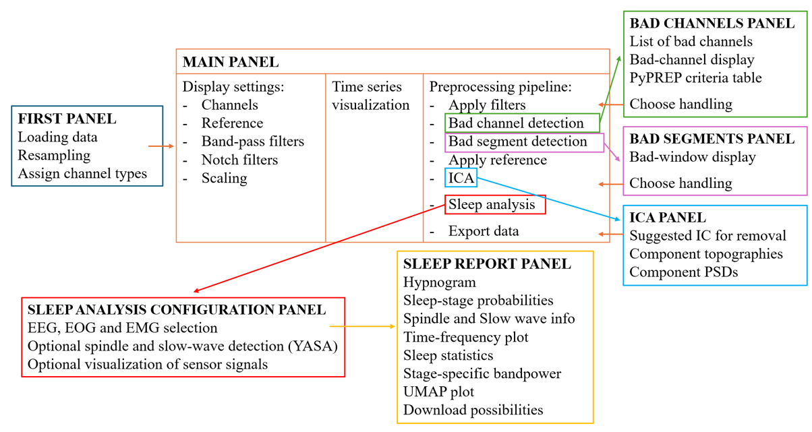
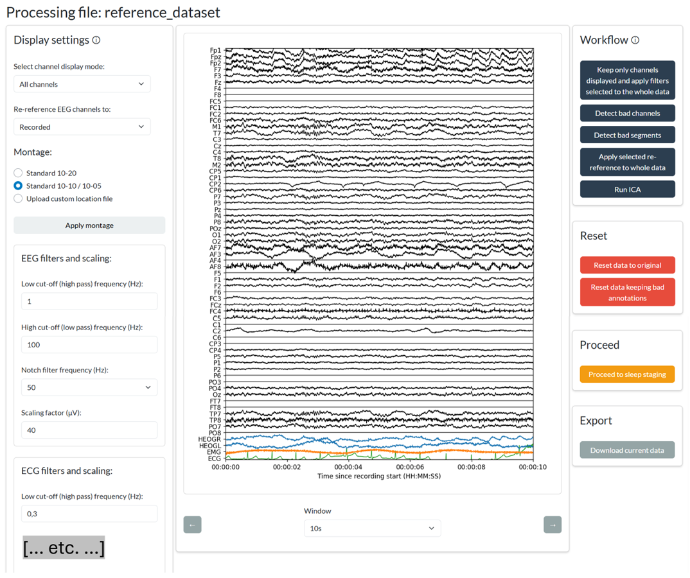

# sleep_EEG_application_ANT-Neuro

## An open-source platform for sleep EEG combining automated processing with clinically relevant sleep metrics
Developed in collaboration with ANT Neuro (https://www.ant-neuro.com/) and built primarily on MNE-Python (Gramfort et al., 2014), this open-source Python Shiny application provides end-to-end analysis of high- and low-density sleep EEG, integrating preprocessing, artefact detection, ICA, sleep staging, event detection, report generation, and visualization of insomnia-related sleep patterns against reference recordings (Goldberger et al., 2000; Terzano et al., 2001) in a user-friendly interface.

## Features
- Load ANT-Neuro CNT and EDF recordings
- Assign EEG, EOG, EMG, ECG, respiration, and other channel types
- Apply standard or custom electrode montages
- Display time-series data
- Apply filtering and rereferencing
- Detect and handle bad channels using PyPREP (Appelhoff et al., 2022)
- Detect and handle bad segments
- Run and label ICA
- Perform automatic sleep staging using YASA (Vallat & Walker, 2021)
- Detect sleep spindles and slow waves using YASA (Vallat & Walker, 2021)
- Calculate sleep statistics and spectral bandpower
- Generate sleep reports and CSV exports
- Visualize insomnia-related metrics using UMAP: sleep-onset latency, sleep-onset latency to five minutes of sleep, sleep efficiency, wake after sleep onset, overall and stage-specific bandpower.

## Overview of the custom platform structure, workflow, interactions and outputs


## Main panel preview


## References

Appelhoff, S., Hurst, A. J., Lawrence, A., Li, A., Mantilla Ramos, Y. J., O’Reilly, C., Xiang, L., Dancker, J., Scheltienne, M., & Bialas, O. (2023). *PyPREP: A Python implementation of the preprocessing pipeline (PREP) for EEG data.* (Version 0.4.3) [Computer software]. Zenodo. https://doi.org/10.5281/ZENODO.10047462

Gorgoni, M., D’Atri, A., Scarpelli, S., Reda, F., & De Gennaro, L. (2020). Sleep electroencephalography and brain maturation: Developmental trajectories and the relation with cognitive functioning. *Sleep Medicine, 66,* 33–50. https://doi.org/10.1016/j.sleep.2019.06.025

Gramfort, A., Luessi, M., Larson, E., Engemann, D. A., Strohmeier, D., Brodbeck, C., Parkkonen, L., & Hämäläinen, M. S. (2014). MNE software for processing MEG and EEG data. *NeuroImage, 86,* 446–460. https://doi.org/10.1016/j.neuroimage.2013.10.027

Terzano, M. G., Parrino, L., Sherieri, A., Chervin, R., Chokroverty, S., Guilleminault, C., Hirshkowitz, M., Mahowald, M., Moldofsky, H., Rosa, A., Thomas, R., & Walters, A. (2001). Atlas, rules, and recording techniques for the scoring of cyclic alternating pattern (CAP) in human sleep. *Sleep medicine, 2*(6), 537–553. https://doi.org/10.1016/s1389-9457(01)00149-6

Vallat, R., & Walker, M. P. (2021). An open-source, high-performance tool for automated sleep staging. *eLife, 10,* e70092. https://doi.org/10.7554/eLife.70092

## Installation

Clone the repository:
```powershell
git clone <repository-url>
cd sleep_EEG_application_ANT-Neuro
```

Create a virtual environment:
```powershell
python -m venv .venv
.venv\Scripts\Activate.ps1
```

Install dependencies:
```powershell
python -m pip install --upgrade pip
python -m pip install -r shiny_app\requirements-freeze.txt
```

Start the application:
```powershell
python -m shiny run src\main.py
```
Open the local address printed in the terminal.
